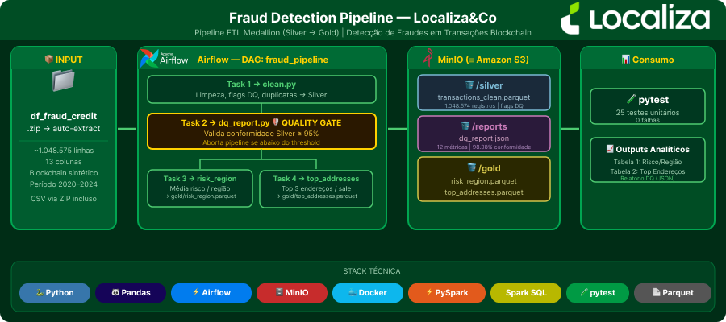

# Fraud Detection Pipeline — Desafio Técnico Localiza&Co

Pipeline de dados ETL para detecção de fraudes em transações blockchain, desenvolvido como desafio técnico para a vaga de Engenheiro de Dados Jr na Localiza&Co.

---

## Sobre o Projeto

Este repositório implementa um pipeline ETL no modelo **Medallion (Bronze → Silver → Gold)**, processando um dataset de transações blockchain sintéticas com indicadores de fraude e risco.

> **Nota sobre o `.env`:** o arquivo foi incluído intencionalmente para permitir execução sem intervenção manual por parte do avaliador. Em produção, credenciais não devem ser versionadas.

**Entrada:** `dados/bronze/df_fraud_credit.zip`  
**Saídas analíticas:**
- Tabela 1 — média de risco por região geográfica (ordenado decrescente)
- Tabela 2 — top 3 endereços receptores por maior valor de venda (última transação por endereço)
- Relatório JSON de qualidade dos dados com quality gate automático (≥ 95%)

---

## Arquitetura



### Stack Tecnológica

| Componente | Tecnologia |
|---|---|
| Engine ETL | **PySpark 3.4.3 + Spark SQL** |
| Orquestrador | Apache Airflow 2.9.0 (TaskFlow API) |
| Object Storage | MinIO — protocolo `s3a://` (equivalente AWS S3) |
| Metadados | PostgreSQL 15 (uso interno do Airflow) |
| Formato de dados | Parquet (Silver/Gold), JSON (Reports) |
| Conteinerização | Docker Compose — imagem custom com Java 17 |

### Fluxo do pipeline

```
dados/bronze/df_fraud_credit.zip  (bind mount)
        │
        ▼  Task: clean (Spark SQL)
s3a://silver/transactions_clean.parquet
        │
        ▼  Task: dq_report (Spark SQL + quality gate)
s3://reports/dq_report.json
        │
   ┌────┴────┐
   ▼         ▼
s3a://gold/  s3a://gold/
risk_region  top_addresses
.parquet     .parquet
```

**Dependências do DAG:** `clean → dq_report → [risk_region ∥ top_addresses]`

O `dq_report` funciona como **quality gate**: se a conformidade geral dos dados cair abaixo de 95%, o pipeline aborta e as tasks Gold não executam.

---

## Mapeamento AWS

| Local (Docker) | Equivalente AWS |
|---|---|
| MinIO / raw | Amazon S3 — Raw Zone |
| MinIO / silver | Amazon S3 + AWS Glue Data Catalog |
| MinIO / gold | Amazon S3 + Amazon Athena |
| MinIO / reports | Amazon S3 |
| Apache Airflow | Amazon MWAA |
| PySpark (local) | AWS Glue ETL |
| Docker Compose | Amazon ECS / EKS |

---

## Pré-requisitos

- [Docker Desktop](https://www.docker.com/products/docker-desktop/) instalado e em execução
- [Git](https://git-scm.com/) para clonar o repositório

> Python e Java **não são necessários** para rodar o ambiente — tudo está encapsulado na imagem Docker.  
> Para executar os testes localmente, é necessário Java 17+ e Python 3.11+.

---

## Como Executar

```bash
# 1. Clone o repositório
git clone https://github.com/FrankYhorans/Fraud_Detection_Pipeline.git
cd Fraud_Detection_Pipeline

# 2. Build e inicialização de todos os serviços (~3-5 min no primeiro build)
#    O build baixa Java 17, PySpark e os JARs S3A automaticamente
docker compose up -d --build

# 3. Aguarde a inicialização (~2 min após o build)
docker compose logs -f airflow-init

# 4. Acesse o Airflow
#    URL:  http://localhost:8080
#    User: admin  |  Pass: admin123

# 5. Ative e execute a DAG "fraud_pipeline"
#    Menu: DAGs → fraud_pipeline → ▶ Trigger DAG
```

### Verificar outputs

Acesse o MinIO Console em `http://localhost:9001`  
Login: `minioadmin` / Senha: `minioadmin123`

Buckets gerados:
| Bucket | Arquivo | Descrição |
|---|---|---|
| `silver` | `transactions_clean.parquet` | Dataset limpo (1.048.574 linhas + 3 flags DQ) |
| `gold` | `risk_region.parquet` | Risco médio por região (5 linhas) |
| `gold` | `top_addresses.parquet` | Top 3 endereços receptores (3 linhas) |
| `reports` | `dq_report.json` | Relatório de qualidade com 12 métricas |

---

## Testes

Os testes usam PySpark em modo local — **Java 17+ deve estar instalado**.

```bash
# Instalar uv (gerenciador de dependências)
pip install uv

# Sincronizar dependências (pyspark, pyarrow, s3fs, pytest)
uv sync

# Rodar todos os testes
uv run pytest tests/ -v
```

**Cobertura:**

| Arquivo | Testes | O que valida |
|---|---|---|
| `test_clean.py` | 7 | flags DQ via SQL, conversão de tipos, deduplicação com prioridade de fraude |
| `test_risk_region.py` | 4 | exclusão de flags, ordenação decrescente, colunas do resultado |
| `test_top_addresses.py` | 4 | filtro por `sale`, exclusão por flag, top 3, regra de timestamp mais recente |
| `test_dq_report.py` | 10 | contagens, OR sem dupla contagem, percentuais, quality gate |

> A SparkSession é compartilhada entre todos os testes (`scope="session"`) — a JVM sobe uma única vez, mantendo a suite rápida.

---

## Estrutura do Projeto

```text
Fraud_Detection_Pipeline/
├── Dockerfile                      # Java 17 + PySpark 3.4.3 + JARs S3A
├── docker-compose.yml              # 6 serviços: minio, minio-init, postgres, airflow x3
├── pyproject.toml                  # Dependências (uv)
├── .env                            # Variáveis de ambiente
│
├── dags/
│   └── fraud_pipeline_dag.py       # DAG Airflow (TaskFlow API)
│
├── dados/
│   └── bronze/
│       └── df_fraud_credit.zip     # Dataset de origem
│
├── src/
│   ├── cleaning/
│   │   └── clean.py                # Bronze → Silver (Spark SQL)
│   ├── transformation/
│   │   ├── risk_region.py          # Gold: risco por região (Spark SQL)
│   │   └── top_addresses.py        # Gold: top 3 endereços (Spark SQL)
│   ├── data_quality/
│   │   └── dq_report.py            # Métricas DQ + quality gate (Spark SQL)
│   └── utils/
│       ├── spark_session.py        # SparkSession com config MinIO/S3A
│       ├── logger.py               # Logger centralizado
│       └── storage.py              # Credenciais MinIO (para s3fs/JSON)
│
└── tests/
    ├── conftest.py                  # SparkSession compartilhada (scope=session)
    ├── test_clean.py
    ├── test_risk_region.py
    ├── test_top_addresses.py
    └── test_dq_report.py
```

---

## Outputs Esperados

### Tabela 1 — Risco por Região (`gold/risk_region.parquet`)

| location_region | avg_risk_score |
|---|---|
| North America | 45.1597 |
| South America | 45.1353 |
| Asia | 44.9929 |
| Africa | 44.9039 |
| Europe | 44.6032 |

> Registros com `location_region = "0"` (5.795 casos) são excluídos pelo filtro SQL `WHERE dq_flag_region = false`.

### Tabela 2 — Top 3 Endereços (`gold/top_addresses.parquet`)

| receiving_address | amount | timestamp |
|---|---|---|
| 0xfe2650f030f2c966775e11009cb015e8852ecf4b | 76.757,0 | 2024-01-02 06:44:13 |
| 0xe37126a5b0724737b516b97d3fb92311021e235d | 76.716,0 | 2023-12-29 11:17:48 |
| 0x646142948a3add1d05edb7789d73a14ef261e109 | 76.667,0 | 2024-01-01 16:14:14 |

> Critério: apenas transações `sale`, `ROW_NUMBER() OVER (PARTITION BY receiving_address ORDER BY timestamp DESC)` para manter a ocorrência mais recente de cada endereço, então `ORDER BY amount DESC LIMIT 3`.

### Relatório de Qualidade (`reports/dq_report.json`)

```json
{
  "total_registros_raw": 1048575,
  "total_registros_apos_limpeza": 1048574,
  "duplicatas_removidas": 1,
  "erros_amount": 5641,
  "erros_risk_score": 5695,
  "erros_location_region": 5795,
  "total_registros_problematicos": 17031,
  "pct_conformidade_geral": 98.38
}
```

---

## Decisões Técnicas

**Por que Spark SQL?**  
O pipeline usa `spark.sql()` para todas as transformações ETL. As queries SQL são parametrizadas por `view_name`, facilitando testes unitários sem dependência de I/O.

**Por que MinIO com protocolo `s3a://`?**  
O Spark acessa object storage via conector Hadoop S3A (`s3a://`). O MinIO simula a API S3 da AWS localmente. A migração para AWS é transparente: basta trocar o endpoint e as credenciais.

**Por que DQ antes do Gold?**  
`clean → dq_report → [risk_region ∥ top_addresses]`: o quality gate valida a camada Silver antes de produzir os dados analíticos. Se a conformidade cair abaixo de 95%, o pipeline aborta com `ValueError` — evitando propagar dados ruins.

**Por que o relatório JSON ainda usa s3fs?**  
`spark.write.json()` gera um diretório com múltiplos arquivos `part-*.json`. Para manter um único arquivo JSON legível, o relatório é salvo via `s3fs.S3FileSystem.open()` diretamente.

---

## Autor

**Frank Yhorans Santos**  
Email: frankyhorans@hotmail.com  
LinkedIn: [frank-yhorans](https://www.linkedin.com/in/frank-yhorans-b2a424114/)  

Desafio Técnico — Engenheiro de Dados Jr | Localiza&Co
